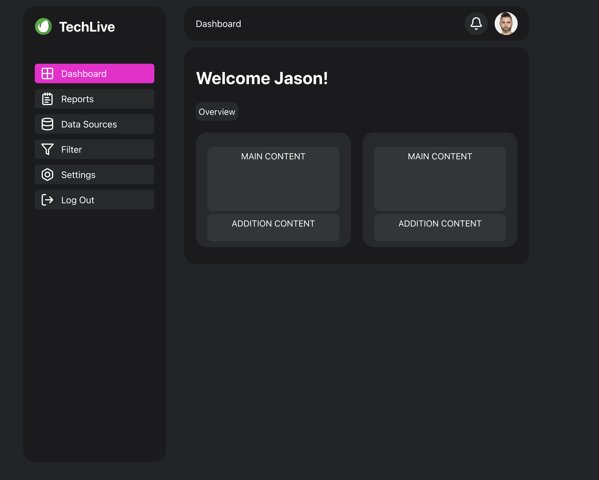

# VERY Simple Dashboard 🚀

#### A clean and minimal **dashboard** built using **Reflex**, a Python framework for web development. This dashboard features a **sidebar**, a **top bar**, and a **main content area** for displaying key information.

## 🚀 How to Run

`pip install reflex`

`git clone https://github.com/AnonimPython/Reflex-simple_dashboard.git`

`cd simple-dashboard`

`reflex run`

## 🚃 How to implement it into your project

Copy functions `link` and `card_box` into your **UI** folder. In main file write `from ..ui.link import link` and `from ..ui.card_box import card_box`

main code from `simple-dashboard.py` replace to your **PAGES** folder.

## 📝 Project structure for implementing the project into your code

```
{your_project}/
├── assets/                # Contains images and static files
    └── favicon.ico  
│   └── {your_images}
├── ui                     # Folder with your UI components
    └── link.py 
    └── card_box.py
├── pages                  # Forlder with pages
    └── simple_dashboard.py 
├── {main_file}.py         # Main Reflex application file
├── README.md  
└── requirements.txt       # List of dependencies
```
